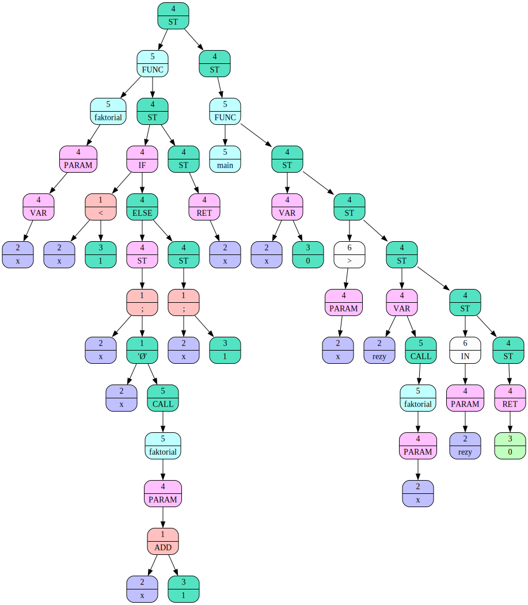

# Язык программирования
В этом проекте я создам свой язык программирования.

## Идея
Для начало нужно было опеределится с идеей языка. Я решил, что создам язык боя. Программирование на моем языке будет ощущаться как бой на ринге. Пример программы на моем языке можно можно посмотреть [тут](./examples/quadratka.txt)

## Frontend
Обработка языка разделена на 3 этапа. Первый этап - frontend. На этом этапе надо обработать текстовый файл с языком и составить дерево на основе программы.

Пример дерева

Дерево составлено в соответствии с общим стандартом. Более подробно о стандарте вы можете посмотреть [тут](https://github.com/dodokek/LanguageStandart).
## Midleend
На этом этапе производятся оптимизации. Программа представленна в виде дерева, поэтому в этом представлении мы можем произвести такую оптимизацию, как свертка значений. То есть выражение ``3 + 4`` превратится в ``7``.
## Backend
Последний этап, это трансляция в ассемблер и исполнение на написанном мной процессоре.
